==============
WSI DeID Usage
==============

Note: This is a Work In Progress and has not been officially released.
======================================================================

* See README.rst for high level information about how to navigate the full documentation.

This document describes how to use the WSI DeID software with the major use case of deidentifying Whole Slide Images (WSIs).

It includes the following major sections:

* Installation
* Girder Background
* User Management
* PHI/PII Definitions and Types
* Workflow Overview
* Navigating the WSI DeID
* Importing Data
* Exporting Data
* Redaction
* Error Messages
* Software Version

Installation
============

See INSTALL.rst for installation instructions.

Girder
======

The WSI DeID is based on the Girder platform. For background on Girder concepts and navigation, see GIRDER.rst.

User Management
===============

User Registration and Logins
----------------------------

When you first interact with the software through your browser, you will need to create a user for that web application by clicking on ``Register or Log In`` as highlighted in the screenshot below, and then registering your user. After registration, you may use the user credentials you created to ``Login`` to the WSI DeID.

 

If you are logged into the WSI DeID, your username will appear in the upper right-hand corner of the screen, like for the user named ``admin`` in the screenshot below.

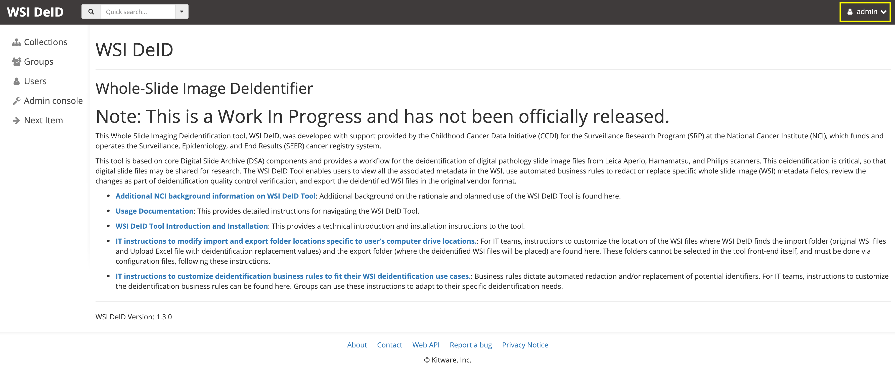
  
User Types and Permissions
--------------------------

See GIRDER.rst for more information.

**Admin User:** The first registered user of a WSI DeID system will be an ``admin`` user and will have super-user privileges, meaning that the user can take any actions on the system. Admin users can change permissions of other users in the system, and can reset users passwords. The Admin user should be tied to an IT support staff member, and users of the system should create Non-Super Users.

**Non-Super Users:** All subsequently created users will be Non-Super Users, who will have the ability to use the redaction workflows.

  
PHI/PII Definitions and Types
=============================

TODO: provide definitions and types of PHI/PII for the purposes of this study.

Workflow Overview
=================

There are six Folders an image file can be in within the WSI DeID Tool, including:

- ``Available To Process``
- ``Quarantined``
- ``Redacted``
- ``Rejected``
- ``Original``
- ``Approved``

The workflow is depicted in the overall workflow diagram below.

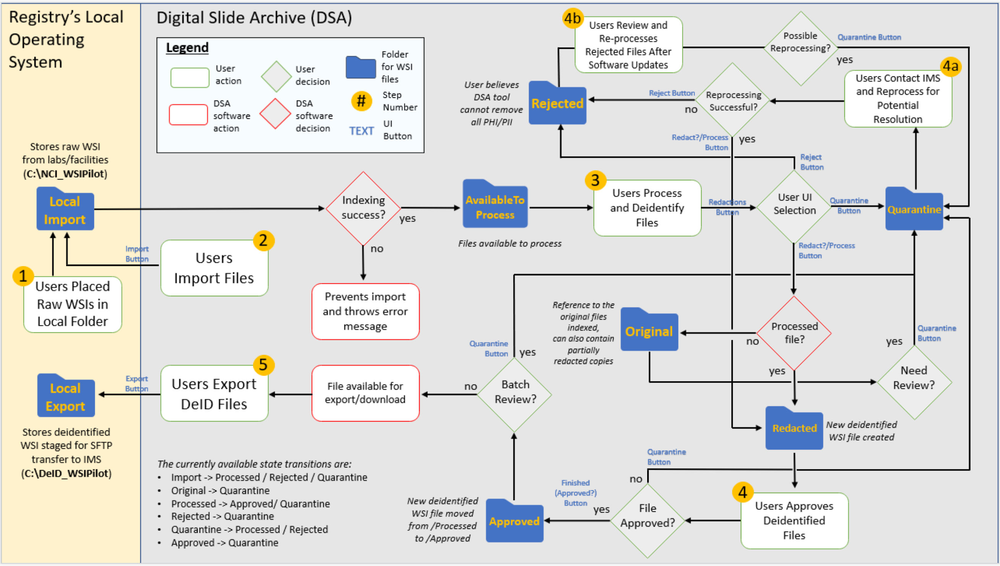

This documentation will walk through the workflow following the steps of the workflow diagram above.

Step 1 Users Place Raw WSIs in Local Folder
-------------------------------------------

The users will place raw WSIs along with an Excel or csv metadata file in their local import folder (a folder on their host filesystem). The metadata file should conform to the expected metadata file specification.

Step 2 Users Import Files
-------------------------

Users navigate to the ``Available To Process`` folder in the WSI DeID and then follow the import process to import files into the system. See the Importing Data section for more information. If the images have import errors, then importing errors will be displayed and the files will not be imported. Corrective action must be taken to fix the files before they can be imported.

When an image is first imported into the WSI DeID from the host filesystem, it will be renamed according to the import process and will be in the ``Available To Process`` folder.

Step 3 Users Process and Deidentify Files
-----------------------------------------

Once an image is in the ``Available To Process`` folder, the user can make the following UI selections:

- "Redact Image" to redact it, sending it to the ``Redacted`` folder, and sending an original file to the ``Original`` folder (go to step 4)
- "Quarantine" for more reprocessing, sending it to the ``Quarantine`` folder (go to step 4a)
- "Reject" to mark that it is impossible to fix, sending it to the ``Rejected`` folder (go to Step 4b)

An image is copied into the ``Original`` folder before it will be redacted and will go into the ``Redacted`` folder, so that an unedited copy of the image is stored.

Step 4 Users Approve Deidentified Files
---------------------------------------

Images in the ``Redacted`` folder have gone through the redaction process, but should be inspected to determine if they still contain PHI/PII or are fully cleared and ready for release.

Once an image is in the ``Redacted`` folder, the user can approve the file. The user can make the following UI selections:

- "Approve" to approve it, once it has been fully cleared for release. If this is pressed, then the image will move to the ``Approved`` folder and then the view will change to the next image to be processed, as if you had clicked on the ``Next Item`` action in the left menu. 
- "Quarantine" for more reprocessing, sending it to the ``Quarantine`` folder (go to step 4a)

Step 4a Users Contact IMS and Reprocess for Potential Resolution
----------------------------------------------------------------

The ``Quarantine`` folder is for holding images that may hold PHI/PII. Users should contact IMS for any WSI files in the ``Quarantine`` folder, and then review files for reprocessing based on instructions from IMS. If PHI/PII is seen in an image or metadata field, that is somewhere other than the ``Available To Process`` folder, it should be quarantined for reprocessing.

Step 4b Users Review and Re-process Rejected Files After Software Updates
-------------------------------------------------------------------------

The ``Rejected`` folder  is available at any time.

If an image is determined to be impossible to fix--perhaps it is too difficult to confirm that PHI/PII has been removed, or if so much data would be removed to de-identify the image that the image data would be useless for research purposes--then the image can be sent to the ``Rejected`` folder by clicking on the ``rejected`` button. Users should contact IMS for any WSI files in the ``Rejected`` folder.

TODO: provide specific examples of when an image should be rejected.

Step 5 Users Export DeID Files
------------------------------

When an image has been de-identified and is cleared for release, it will be in the ``Approved`` folder. The export process, described in the Exporting Data section below, will copy approved files to the export location.

In the ``Approved`` folder, two buttons appear at the top: ``Export Recent`` and ``Export All``, that will allow the user to export images.

   
Navigating the WSI DeID
=======================

Navigating by Folder
--------------------

After logging in, from the home page click on the ``Collections`` link on the left menu and then click on the ``WSI DeID`` collection link, which is shown in the below screenshot.

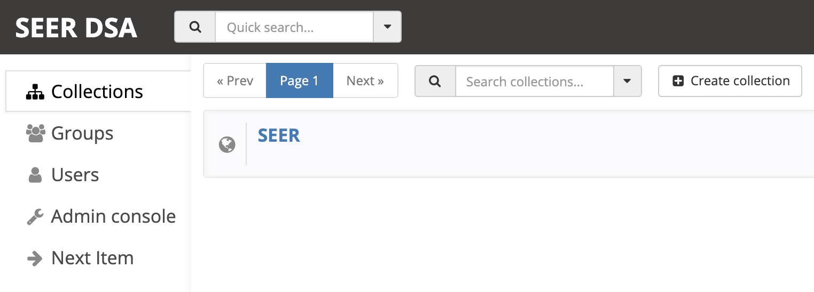

After clicking on the ``WSI DeID`` collection link, you will be in the ``WSI DeID`` collection and should see the ``WSI DeID`` specific folders.
  
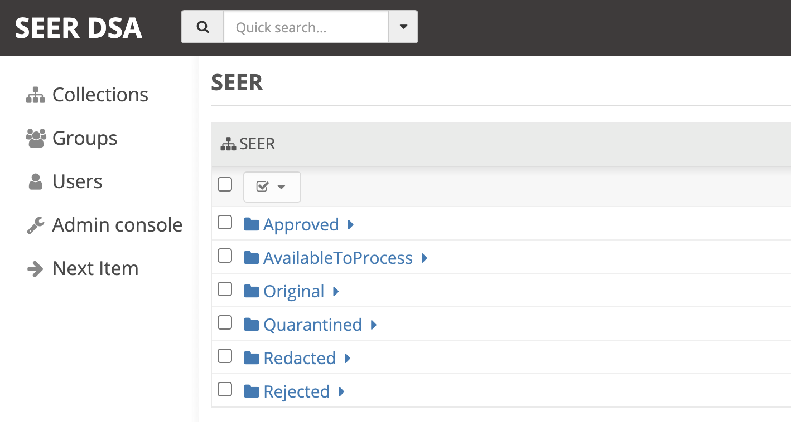
   
From this folder listing, you can navigate to any folder you wish by clicking on the folder name link. For example, if you want to import data, go to the ``AvailableToProcess`` folder, or if you want to export data, go to the ``Approved`` folder. See the Workflow Overview section above for a description of each folder.

Next Item Action
----------------

Clicking on the ``Next Item`` link on the left menu will bring you to view the first image in the ``AvailableToProcess`` folder, or else the first image in the ``Quarantined`` folder if there are no images in the ``AvailableToProcess`` folder.

For descriptions of other actions in the left menu, see GIRDER.rst.

Folder Versus Item Views
------------------------

The WSI DeID is based on Girder (see GIRDER.rst for more information), which is structured as Folders and Items. **Folders** are similar to a directory on your local computer's filesystem; whereas, **Items** are a container for one or more files, such as would be on your local computer's filesystem. For the purposes of the WSI DeID documentation, an image is an item and  may be used interchangeably. A whole slide image file may contain multiple images, such as in the case where there is a primary image and associated images, such as a label or macro image.

A folder in Girder may contain items, and an item always has to be in a folder. When looking at the WSI DeID, if you are in a folder, you will see the folder icon on the upper right of the screen, as shown in the screenshot below taken from an ``AvailableToProcess`` folder. In this case, the folder has zero children folders and ten items within the folder, which is why there is an icon of a folder with a ``0`` and an icon of a document with a ``10`` in the screenshot.

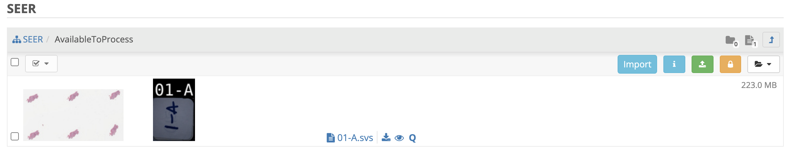
   
To see an item view of an image, click on the image/item's row in the folder view. You will then go to the item view, which looks like the below screenshot, of an item named ``01-A.svs`` that is located in the ``AvailableToProcess`` folder. In the info panel you can see some metadata such as the image size and WSI DeID creation date. The item view will present you with subsections for a panning/zooming ``Image Viewer``, a listing of ``Large Image Metadata``, the set of ``Associated Images``, and image/item specific ``WSI DeID Workflow`` actions.

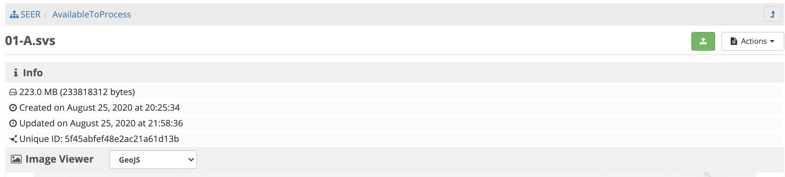

Below is a screenshot of the action buttons available in the ``WSI DeID Workflow`` section of the ``AvailableToProcess`` folder. Different folders will present different combinations of buttons, see the Workflow Overview section above for details.
  
 .. image:: screenshots/wsideid_workflow_buttons.png
   :height: 100
   :width: 200
   :alt: WSI DeID workflow buttons

Importing Data
==============

The import process assumes that the system has been configured with a mounted import directory, that is, the local filesystem folder that was mounted as the import path in the docker-compose configuration.

Imported Files and Folders
--------------------------

Files are automatically copied from the local import directory to the ``AvailableToProcess`` folder in the ``WSI DeID`` collection in the WSI DeID. Files can have any folder structure; the folder structure is not significant in the import process. Excel files (identified by ending in .xls or .xlsx) and image files (anything else except for ignored files) will be imported. To facilitate bulk uploads, we ignore files ending in .txt, .xml, .zip from the import process -- this list can be easily changed.

Import Process
--------------

From the ``AvailableToProcess`` folder (or any sub folder) in the WSI DeID, click on the ``Import`` button, as shown in the below screenshot.

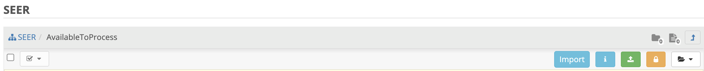

A background process starts that scans through the mounted import directory, and does the following:

- Each Excel file is parsed for a header row that has TokenID, ImageID, and ScannedFileName.
- If there are any Excel files that do not have a header row, an error is generated and appears on the screen, and files are not imported.
- If the same ScannedFileName is listed in multiple Excel files, the newest file is used by preference.
- The ScannedFileName is expected to be just the file name (e.g., no folder path).

After the image names and information in the metadata file are reconciled, the WSI DeID will classify images as one of the following:

- ``present``: The image is listed in an Excel file and is already in the WSI DeID based on file path and matching file size. No action is performed.
- ``added``: The image is listed in an Excel file and is not in the WSI DeID. It is added in the ``AvailableToProcess`` directory in a folder named TokenID with a filename ImageID.<extension>.
- ``replaced``: The image is listed in an Excel file, is in the WSI DeID, but has a different file size from the image in the WSI DeID. The existing file is removed from the WSI DeID and re-added.
- ``missing``: The image is listed in an Excel file but is not in the import directory. No action is performed.
- ``unlisted``: The image is not listed in an Excel file but is in the import directory. No action is performed.
- ``failed``: The listed file cannot be read as an image file.

After all images and Excel metadata files have been processed, a message is displayed summarizing what images were in each of the five classifications above (e.g., "Import complete. 19 files added. 1 file missing from import folder"), and then UI is then refreshed.

Below is a screenshot of a message presented to the user after an import.

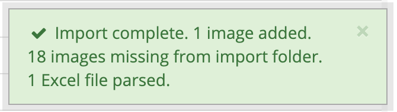

Exporting Data
==============

When images are in the ``WSI DeID`` collection, in the ``Approved`` folder, they can be exported out of the DSA WSI DeID for transfer. 

In the ``Approved`` folder, two buttons appear at the top: ``Export Recent`` and ``Export All``, as shown in the screenshot below. Clicking either copies files from the ``Approved`` folder to the mounted export folder, that is, to the local filesystem folder that was mounted as the export path in the docker-compose configuration. The subfolder structure within the ``Approved`` folder is maintained as part of the export. If a file already exists in the export folder, then that file will be skipped during the export process so as to not overwrite the existing file in the export directory. 

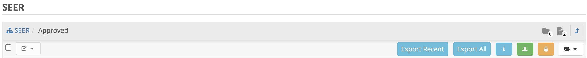

Recent exports are any items in the ``Approved`` folder that have not been exported before. After each export, items are tagged with metadata indicating that they have been exported.

After export, a message is shown indicating how many files were exported, how many were already present (based on having the same file name) and the same file size, and how many were already present and differed in file size.

Redaction
=========

At a high level in the Redaction process, the user can inspect the image and metadata for PHI/PII, and can indicate if any of these should be redacted. Redaction can occur from the ``Available To Process`` or ``Quarantined`` folder. Below are the specific steps to follow for the Redaction process. When a field is redacted so that it is changed, the original value in that redacted data field is completely replaced with the new value. When a field or image is redacted completely, it is removed and will not be available in the future.

1. Reviewing the image(s) and metadata for PHI/PII.

  1.1 Open the WSI file, either by clicking on a specific Item or clicking the ``Next Item`` action.

  1.2 Review the image(s) and metadata fields for PHI/PII.

    1.2.1 Review the image. If the low-resolution image at the top of the screen (see screenshot below) contains PHI/PII, then click XXX. If there is no PHI/PII, then go on to the next step. You may zoom and pan in the low-resolution image to see areas of the image in higher resolution.

    TODO: what to do in this case? Reject?

    1.2.2 Review metadata for PHI/PII, by scrolling down below the main image to the metadata section display. Some metadata fields will be automatically pre-redacted upon import, including titles and dates that are specific to each scanner manufacturer. See the Business Rules for WSI DeID section below for details.

    The user can view metadata fields, and if any of these contain PHI/PII, the user should click the ``redact`` action for that field. The ``redact`` action will then have a line through the text, indicating that the field will be redacted (it has been marked for redaction).

    1.2.3 Scroll down to the bottom of the screen and review the associated images (label, macro, and thumbnail).  If you see PHI/PII in individual associated images, redact and process them.

    1.2.4 When redaction decisions have been made for all images and metadata, the user should click the ``Redact Image`` button, which will make a copy of the existing image and place that copy in the ``Original`` folder, and will move the image to the ``Redacted`` folder. As part of moving the data to the ``Redacted`` folder, the metadata fields and associated images that have been marked for redaction will be deleted.

  1.3 If after redacting, all PHI/PII has been removed, click the green ``Approved`` button.

Business Rules for WSI DeID
---------------------------

These business rules will be automatically applied at the time of data import to the metadata.

The following rules apply to all file formats:

* Tiff DateTime (if present), set to 01:01:(year and time)
* Copyright: removed
* HostComputer: removed
* tiff.Software: suffix with our custom tags

These rules apply only to Aperio files:

* aperio.Filename: change or add to ImageID
* aperio.Title: change or add to ImageID
* aperio.Date (if present), set to 01/01/(year)

These rules apply only to Hamamatsu files:

* hamamatsu.Reference: change or add to ImageID
* hamamatsu.Created (if present): set to (year)/01/01
* hamamatsu.Updated (if present): set to (year)/01/01

These rules apply only to Philips files:

* PIIM_DP_SCANNER_OPERATOR_ID: change or add to ImageID
* PIM_DP_UFS_BARCODE: change or add to ImageID
* DICOM_DATE_OF_LAST_CALIBRATION (if present): set to (year)0101
* DICOM_ACQUISITION_DATETIME (if present): set to (year)0101 (time)

TODO: update below screenshots.

Below is a screenshot of image PHI/PII redaction controls for metadata. 

The ``aperio.AppMag`` field has been staged for redaction.

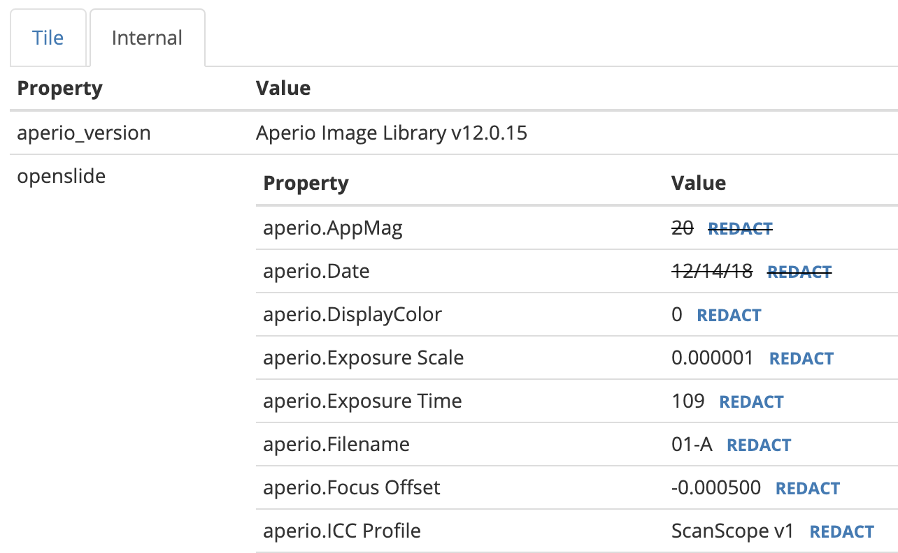
   
Below is a screenshot of image PHI/PII redaction controls for Associated Images, with the ``Thumbnail`` image staged for redaction.

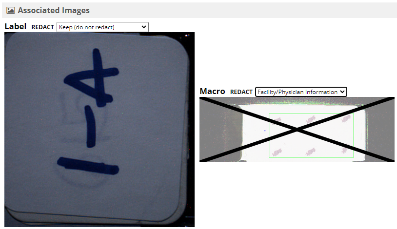

Label images that are redacted are replaced with a black image that contains text of the item's new name (for the purposes of the WSI Pilot this new name will be the ImageID), such as in the screenshot below.
   
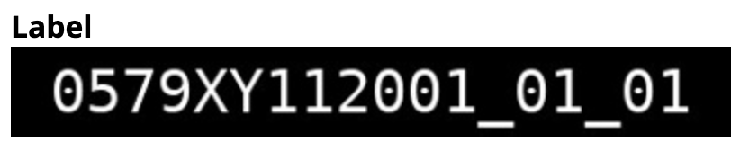
   
Error Messages
==============

The following table provides more detailed explanations for error messages that WSI DeID users may encounter.

+-----+---------------+------------------+
| ID# | Error Message |  When triggered? |
+-----+---------------+------------------+
| ID# | Error Message |  When triggered? |

+-----+-------------------+----------------------------------------------------------------------------------------------------------------------------------------------+
| ID# | Error Message     |  When triggered? |
+-----+-------------------+----------------------------------------------------------------------------------------------------------------------------------------------+
| 1.  | Import Completed  |  Whenever an import run was attempted and completed regardless of the result or if any issues with the input WSI files or DeID Upload File. |
+-----+-------------------+----------------------------------------------------------------------------------------------------------------------------------------------+

1. ``Import Completed`` Whenever an import run was attempted and completed regardless of the result or if any issues with the input WSI files or DeID Upload. 

+---------+------------------------+-------------------------------------+
| ID#     | WSI DeID Error Message | How is the error message triggered? |
+=========+========================+=====================================+
| 1       | Import Completed       | Whenever an import run was attempted and completed regardless of the result or if any issues with the input WSI files or DeID Upload File. |
+---------+------------------------+-------------------------------------+

2

Import process completed, with errors

when the system is working, sees folders and WSI, but something off such as a file cannot be imported for some semantic issues

3

Nothing to import. Import Folder is empty

when the import folder is empty and an import run was attempted

4

Failed to import.

will only be displayed if there is a condition that we did not anticipate (which means that I can't give an example of how to make it appear).  If this occurs, it probably means someone needs to check the logs and figure out what happened and how to improve things in a future version.

5

(number) image(s) added.

number of WSI files that were successfully imported

6

(number) image(s) with duplicate ImageID.  Check DeID Upload file.

will occur if a different input file to be imported has the same ImageID as an input file that is already staged in the AvailableToProcess folder in the DSA

7

(number) image(s) missing from import folder. Check Upload File and WSI image filenames.

when the input image file referenced in the Upload File is missing from the import folder (could also happen due to naming differences)

8

(number) image(s) in import folder, but not listed in the DeID Upload Excel/CSV file.   

when an input file is present in the import folder but not referenced in the DeID Upload file (could also happen due to naming differences)  (e.g. 10 WSI files, but not same 10 WSI files listed in the DEID Excel)

9

(number) image(s) already present.

when the import was performed and the identical data (input file) is already staged in the AvailableToProcess folder

10

(number) image(s) failed to import. Check if image file is in accepted WSI format. 

when the image file is not compatible to the DSA and import of the file is not successful (e.g. .isyntax files)

11

(number) of DeID Upload Excel file(s) parsed.

the number of excel files (DeID Upload Files) that was successfully read and used for referencing input image files in the import folder

12

Import process completed with errors. No DeID Upload file present.

when the DeID Upload file is missing from the import folder

13

(number) image(s) with invalid data in a DeID Upload File

When metadata associated with a WSI is incorrectly listed in the DeID Upload File

14

(number) Excel file(s) could not be read.

appears if you have a file whose name ends in xls, xlsx, or csv and is NOT an excel file or text file, for instance by using a Word file that was renamed to end in ".xls".

15

Nothing to import. Import folder is empty.

If local import folder is empty

16

Recent export task completed

whenever an export run (via the "Export Recent" button) was attempted and processed regardless of the result

17

Failed to export recent items.  Check export file location, if there is sufficient space, or other system issue.

when an export run (via the "Export Recent")  was not processed due to incorrect export path location, export file name or some server/computing issues

18

Export all task completed

whenever an export run (via the "Export All" button) was attempted and processed regardless of the result

19

Failed to export all items.  Check export file location, if there is sufficient space, or other system issue.

when export run (via the "Export All")  was not processed due to incorrect export path location, import file name or some server/computing issues

20

(number) image(s) exported.

when processed WSI files in the "Approved" file is successfully exported to the local export folder

21

(number) image(s) with the same ImageID(s) but different WSI file size already present in Export Folder. Remove the corresponding image(s) from the export directory and select Export again.

when export actions (via "Export Recent" or "Export All") were selected and there is a file with the SAME ImageID is already in the local export folder BUT the actual WSI contents between the files, exported vs. to-be-exported, are different. This is a way to tell users that a file with the same ImageID is already exported, however, the source WSI file or processed contents are not the same as the one with the same ImageID that is to be exported

22

(number) image(s) previously exported and already exist in export folder

when export actions (via "Export Recent" or "Export All") were selected and there is already a file with the same ImageID in the local export folder

23

(number) image(s) currently quarantined. Only files in "Approved" workflow stage are transferred to Export folder.

when export actions (via "Export Recent" or "Export All") were selected and there are WSI files in the "Quarantine" folder

24

(number) image(s) with rejected status. Only files in "Approved" workflow stage are transferred to Export folder.

when export actions (via "Export Recent" or "Export All") were selected and there are WSI files in the "Rejected" folder

25

Nothing to export.  

when export actions (via "Export Recent" or "Export All") were selected but the "Approved" folder is empty

Software Version
================

If you have found a bug, it is helpful to know what the software version is when you report the bug to your support channels. The software version can be found on the front page of the web application and will be in the section that looks like ``WSI DeID Version: 1.3.0``. In this example the version string is ``1.3.0``, but you should expect a different version string for your WSI DeID instance.

