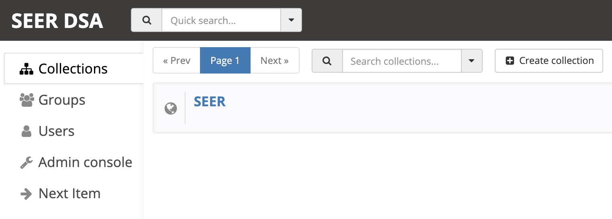
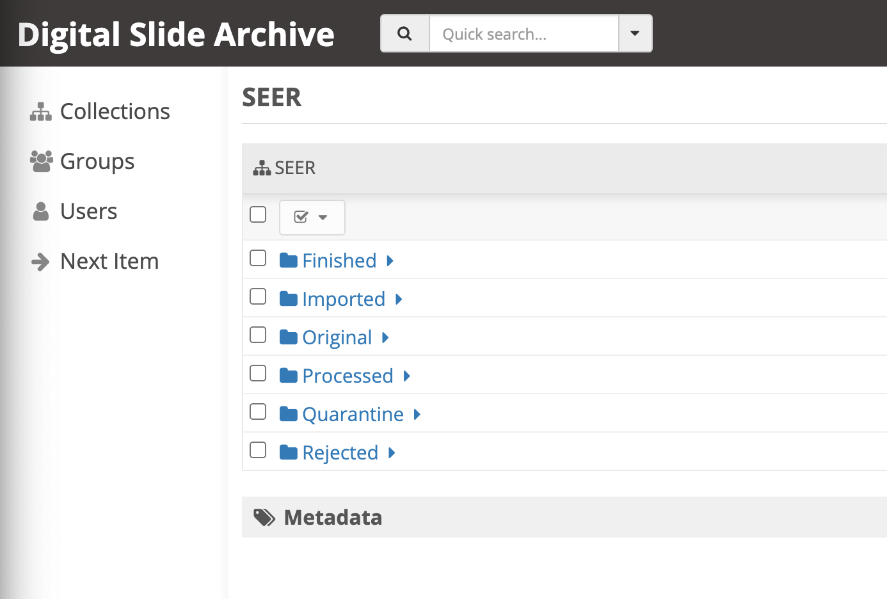
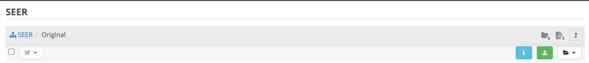
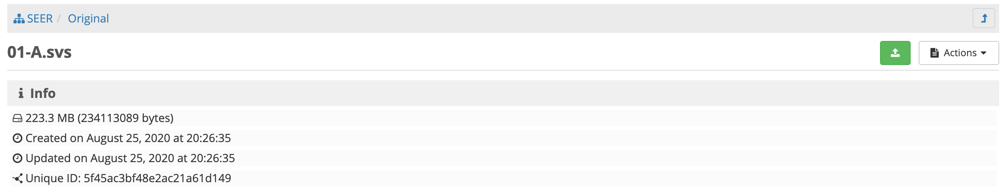

=================================
NCI SEER Pediatic WSI Pilot Usage
=================================

See README.rst for installation.

Reporting Bugs
==============

If you have found a bug, open a `GitHub issue <https://github.com/DigitalSlideArchive/NCI-SEER-Pediatric-WSI-Pilot/issues>`_ and describe the problem, the expected behavior, and your version of the software. The software version can be found on the front page of the web application, and will look like ``NCI SEER Version: 1.0.0.dev63+g85b49b4.d20200825``.

User Management
===============

User Registration and Logins
----------------------------

When you first create an installation of the software, e.g. through ``docker-compose up``, you will need to create a user for that web application by clicking on ``Register``. After registration, you may use the user credentials you created to ``Login`` to the DSA.

If you are logged into the DSA, your username will appear in the upper right hand corner of the screen, like for the user named ``test`` in the below screenshot.

.. image:: screenshots/test_user.png
   :height: 100
   :width: 200
   :alt: test user logged in
  

User Types and Permissions
--------------------------

The first registed user of a DSA system will be an ``admin`` user and have super-user privileges, meaning that user can take any actions on the system. All subsequently created users will be regular, non-super-users, but will have the ability to use the redaction workflows.

If no user is logged in, you are said to be browsing the DSA as the ``anonymous`` user. The ``anonymous`` user may browse data in the DSA, but cannot take any actions that redact data or change the state of data. When you are browsing as the ``anonymous`` user you will see the option to ``Register or Log In`` as in the below screenshot.

.. image:: screenshots/register_or_login.png
   :height: 100
   :width: 200
   :alt: register or log in
   
   
Navigating the SEER DSA
=======================

Navigating By Folder
--------------------

From the home page, click on the ``Collections`` link on the left menu and then click on the ``SEER`` collection link, which is shown in the below screenshot.

After clicking on the ``SEER`` collection link, you will be in the ``SEER`` collection and should see the ``SEER`` specific folders corresponding to workflow states described in the ``Workflow States and Transitions`` section below and as shown in the below screenshot.
  

   
From this folder listing, you can navigate to any folder you wish by clicking on the folder name link. For example, if you want to import data, go to the ``Imported`` folder, or if you want to export data, go to the ``Finished`` folder.

Next Item Action
----------------

Clicking on the ``Next Item`` link on the left menu will bring you to view the first image in the ``Imported`` folder, or else the first image in the ``Quarantine`` folder if there are no images in the ``Imported`` folder.

Folder Versus Item Views
------------------------

The DSA is based on Girder, which has a notion of Folders and Items. Folders are similar to a directory on your local computer's filesystem, whereas Items are a container for one or more files, such as would be on your local computer's filesystem. For the purposes of the DSA documentation, an image is an item and they may be used interchangably. An image may contain multiple images, such as in the case where there is a primary image and Associated Images such as a label or macro image.

A folder in Girder may contain items, and an item always has to be in a folder. When looking at the DSA, if you are in a folder, you will see the folder icon on the upper right of the screen, as shown in the screenshot below taken from an ``Original`` folder. In this case, the folder has zero children folders and three items within the folder, which is why there is an icon of a folder with a ``0`` and an icon of a document with a ``3`` in the screenshot.

   
To see an item view of an image, click on the image/item's row in the folder view. You will then go to the item view, which looks like the below screenshot, of an item named ``01-A.svs`` that is located in the ``Original`` folder. In the info panel you can see some metadata such as the image size and DSA creation date. The item view will present you with subsections for a panning/zooming ``Image Viewer``, a listing of ``Large Image Metadata``, the set of ``Associated Images``, and image/item specific ``SEER Workflow`` actions.

Importing Data
==============

The import process assumes that the system has been configured with a mounted import directory, that is, the local filesystem folder that was mounted as the import path in the docker-compose configuration.

Imported Files and Folders
--------------------------

Files are copied from the local import directory to the ``Imported`` folder in the ``SEER`` collection in the DSA. Files can have any folder structure; the folder structure is not significant in the import process. Excel files (identified by ending in .xls or .xlsx) and image files (anything else except for ignored files) will be imported. To facilitate bulk uploads, we ignore files ending in .txt, .xml, .zip from the import process -- this list can be easily changed.

Import Process
--------------

From the ``Imported`` folder (or any sub folder) in the DSA, click on the ``Import`` button.

A background process starts that scans through the mounted import directory, and does the following:

- Each excel file is parsed for a header row that has TokenID, ImageID, and ScannedFileName.
- If there are any excel files that do not have a header row, an error is thrown and no import is performed.
- If the same ScannedFileName is listed in multiple excel files, the newest file is used by preference.
- The ScannedFileName is expected to be just the file name (e.g., no folder path).

After the image names and information in the metadata file are reconciled, the DSA will classify images as one of the following:

- ``present``: The image is listed in an excel file and is already in the DSA based on file path and matching file size. No action is performed.
- ``added``: The image is listed in an excel file and is not in the DSA. It is added in the ``Imported`` directory in the a folder named TokenID with a filename ImageID.<extension>.
- ``replaced``: The image is listed in an excel file, is in the DSA, but has a different file size from the image in the DSA. The existing file is removed from the DSA and re-added.
- ``missing``: The image is listed in an excel file but is not in the import directory. No action is performed.
- ``unlisted``: The image is not listed in an excel file but is in the import directory. No action is performed.

After all images and excel metadata files have been processed, a message is displayed summarizing what images were in each of the five states above (e.g., "Import complete. 19 files added. 1 file missing from import folder"), and then UI is then refreshed.

Exporting Data
==============

When images are in the ``SEER`` collection, in the ``Finished`` folder, they can be exported. 

In the Finished folder, two buttons appear at the top: ``Export Recent`` and ``Export All``. Clicking either copies files from the ``Finished`` folder to the mounted export folder, that is, to the local filesystem folder that was mounted as the export path in the docker-compose configuration. The subfolder structure within the ``Finished`` folder is maintained as part of the export. If a file already exists in the export folder, then that file will be skipped during the export process so as to not overwrite the existing file in the export directory. 

Recent exports are any items in the Finished folder that have not been exported before. After each export, items are tagged with metadata indicating that they have been exported.

After export, a message is shown indicating how many files were exported, how many were already present (based on having the same name) and the same size, and how many were already present and differed in size.

Redaction
=========

Many of the workflow states provide controls to allow the user to indicate PHI that should be redacted, staging that PHI for processing.

The user can inspect the image and metadata for PHI, can mark individual metadata fields for redaction from the ``imported`` or ``quarantine`` state, and can indicate if any of the associated images should be redacted. When all PHI has been staged for redaction, the user can click the ``Process`` button, which will make a copy of the existing image and place that copy in the ``original`` state, and will move the image to the ``processed`` state. As part of moving the data to the ``processed`` state, the metadata fields and associated images marked for redaction will be deleted.

All of the files the DSA handles currently are variants of TIFF. When a field is redacted in such a way as to change it (e.g., titles and dates), the original value is completely replaced with the new value. When a field or image is redacted completely (any other field other than titles and dates), it is removed. Label images that are redacted are replaced with a black image that contains text of the item's new name (this will be the ImageID).

Example Walkthrough
===================

There are multiple paths through the system, to see the details of each state and the transitions between them see the ``Workflow States and Transitions`` section below. This section will describe one simple path through the system as an example to pull the pieces together.

Start out by putting images and a metadata excel file in the import directory on the local filesystem, then run the ``Import`` command in the DSA, from the ``Imported`` folder in the ``SEER`` collection. The images will now appear in the ``Imported`` folder in the DSA.

Click on an individual image (an item view of the image) to view the redaction controls. Click on the ``Redact`` controls for any pieces of textual metadata and any of the associated images that should be redacted. Then click the ``Process`` button at the bottom of the page.

At this point, a copy of the original image without any redaction will appear in the ``Original`` folder, so that a pre-redaction record is kept. The redacted image will be moved to the ``Processed`` folder, and any pieces of metadata that were redacted will now be deleted. Any associated images that were redacted will also be deleted.

Click on the ``Finish`` button at the bottom of the page, and the image will be moved to the ``Finished`` folder. Click on the folder view of the ``Finished`` folder, and then click ``Export Recent`` to export this redacted image, which will then be copied to the export directory on the local filesystem.

Workflow States and Transitions
===============================

There are several states an image can be in, including:

- imported
- quarantine
- processed
- rejected
- original
- finished

These states correspond to named folders, i.e., an image will be in the ``imported`` state at the time it lives in the ``imported`` folder, as long as users move images between states using the DSA UI tools. By using other Girder admin tools, it is possible to break the correspondence between the state and the folder name, but that should be an exceptional and unusual case.

The reason that there are named states that are separate from named folders is so that workflow provenance can be tracked. An image may currently be in the ``quarantine`` state in the ``quarantine`` folder, but the image's workflow history indicates that it had previously been in the ``imported`` state before the ``quarantine`` state.

For the remainder of this discussion, assume that the name of the folder corresponds to the name of the current state of the image, e.g., when an image is in the ``imported`` state it will also be in the ``imported`` folder.

Import
------

When an image is first imported into the DSA from the host filesystem, it will be renamed according to the import process and will be in the ``imported`` state.

Once an image is in the ``imported`` state, the user can click:

- "Process" to redact it
- "Quarantine" for more reprocessing
- "Reject" to mark that it is impossible to fix

Processed
---------

Images in the ``processed`` state have gone through the redaction process, but should be inspected to determine if they still contain PHI or are fully cleared and ready for release.

Once an image is in the ``processed`` state, the user can click:

- "Finish" to approve it, once it has been fully cleared for release
- "Reject" to mark that it is impossible to fix
- "Quarantine" for more reprocessing

Rejected
--------

The ``rejected`` state is available at any time. If an image is determined to be impossible to fix--perhaps it is too difficult to confirm that PHI has been removed, or if so much data would be removed to de-identify the image that the image data would be useless for research purposes--then the image can be sent to the ``rejected`` state by clicking on the ``rejected`` button. From the ``rejected`` state the image can always be sent to the ``quarantine`` state.

Original
--------

An image is copied into the ``original`` state before it will be redacted and go into the ``processed`` state, so that a pre-redaction copy of the image is stored with the full provenance record of what steps the image went through up until the time of processing.

Finished
--------

When an image has been de-identified and is cleared for release, it will be in the `finished` state. Export will copy finished files to the export location using NCI's specified folder structure.

In the Finished folder, two buttons appear at the top: ``Export Recent`` and ``Export All``, that will allow the user to export images. See the ``Exporting Data`` section above for details.

Quarantine
----------

The ``quarantine`` state can be reached from any other state, and is for holding images that may hold PHI and thus should be inspected and potentially reprocessed. It would generally be used if an image has been redacted already but more redaction is necessary. This state provides controls to allow the user to mark the PHI that should be redacted, staging that PHI for processing.

Images be quarantined from any state.  If PHI or potential PHI is seen in an item that is somewhere other than the ``imported`` folder, it should be quarantined for reprocessing.

