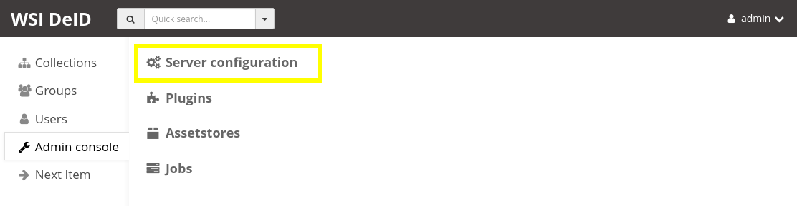
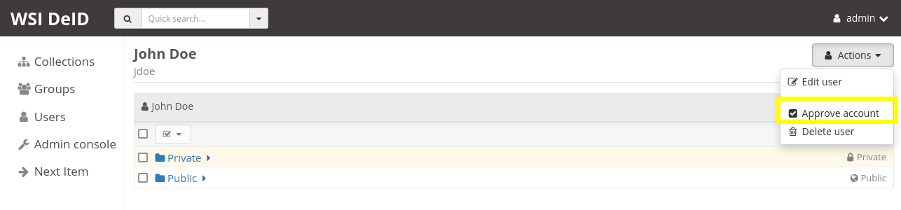

Installation
============

See `README.rst <../README.rst>`_ for high level information about how to navigate the full documentation.

.. contents:: Table of Contents
    :depth: 1
    :local:
    :backlinks: none

Prerequisites
-------------

At a minimum, you will need `Docker <https://docs.docker.com/install/>`_ and `docker-compose <https://docs.docker.com/compose/install/>`_.  You also will need a copy of this repository, either obtained via ``git`` or downloaded directly.  If you have ``git`` installed, this can be::

    git clone https://github.com/DigitalSlideArchive/DSA-WSI-DeID.git

Install commands need to be run from the ``devops/wsi_deid`` directory.  Examples are given via a command prompt, but a desktop version of Docker will work as well.

To download the repository directly, go to the `Releases Page <https://github.com/DigitalSlideArchive/DSA-WSI-DeID/releases>`_ and select the source code zip or tar.gz file for the desired version, or download the `master branch <https://github.com/DigitalSlideArchive/DSA-WSI-DeID/archive/master.zip>`_.

The software is known to work with a variety of operating systems:

- Windows 10 or Windows 11 with Windows Subsystem for Linux (WSL) installed and Docker Desktop

- Ubuntu (version 18.04 and later)

- AlmaLinux (version 9 or later).

- Windows Server 2019.  This operating system require some additional changes beyond the default install configuration, see `below for an example and comments <#windows-server-2019>`__ on using WS 2019.

Note: the software can work on OSX, but using OCR of label data is unusably slow.

Hardware Requirements
~~~~~~~~~~~~~~~~~~~~~

The recommended hardware is 32 GBytes of memory on a system with at least 4 cores.  If you are using OCR, it is recommended to have an NVidia Cuda-capable GPU.

The minimum hardware is 4 GBytes of memory on a system with at least 2 cores, 8 GBytes if using OCR, and 12 GBytes if using iSyntax files.

The speed of your storage greatly affects the speed of the system.  SSD drives will for import, local storage, and export are recommended.

Virtual Servers
~~~~~~~~~~~~~~~

The system can work on virtualized servers, such as inside a VirtualBox instance of Ubuntu or a virtualized Windows Server.  In order for this to work, passthrough virtualization needs to be enabled on the host operating system in both hardware and software.  See Docker's documentation on this topic if you have issues getting the system to work on a virtualized server.

As an example, to run the system on a virtualized Windows server in a cloud service, such as EC2, container support needs to be enabled and WSL installed.  This combination may require special permissions beyond the standard available machine instances that are readily available in your cloud service.

Import and Export Paths
-----------------------

If you want to import and export data from your local filesystem into the system, you will need to set up import and export paths, by mounting specific directories for import and export of files.  This set up is most readily done by creating a secondary docker-compose yaml file in the ``devops/wsi_deid`` directory, named ``docker-compose.local.yml`` which contains the following content (note that Windows Server 2019 may require changes to this file, see `below for an example and comments <#windows-server-2019>`__ on using WS 2019)::

    ---
    services:
      girder:
        # Change "stable" to a version number (e.g., dsarchive/wsi_deid:v1.0.0)
        # to use a fixed version
        image: dsarchive/wsi_deid:stable
        volumes:
          - c:\NCI_WSI:/import
          - c:\DeID_WSI:/export

where the first part of the last two lines are paths on the local system that should be mounted into the ``import`` and ``export`` paths of the program, i.e. ``c:\wsi_deid\import:/import`` specifies that the local filesystem directory ``c:\wsi_deid\import`` is mounted into the program as the ``/import`` path.  To use these defined import and export paths, instead of typing ``docker-compose up -d``, type::

    docker-compose -f docker-compose.yml -f docker-compose.local.yml up -d

which will extend and override the definitions in ``docker-compose.yml`` with those in ``docker-compose.local.yml``.

Initial Start
-------------

From a command prompt in the ``devops/wsi_deid`` directory, if you are using import and export paths, type::

    docker-compose pull
    docker-compose -f docker-compose.yml -f docker-compose.local.yml up -d

or without the import and export paths, type::

    docker-compose pull
    docker-compose up -d

This set up will download some necessary files (pre-built docker images) and start the system.  The database, local files, and some logs are stored in docker volumes.

The system will be available from a web browser on http://localhost:8080.

Note: If you prefer a different locally mounted port, you can specific that via an ENV VAR ``DSA_PORT``, e.g.::

    DSA_PORT=8888 docker-compose -f docker-compose.yml -f docker-compose.local.yml up -d

Update an Existing System
-------------------------

From a command prompt in the ``devops/wsi_deid`` directory, if you are using import and export paths, type::

    git pull
    docker-compose pull
    docker-compose down
    docker-compose -f docker-compose.yml -f docker-compose.local.yml up -d

or without the import and export paths, type::

    git pull
    docker-compose pull
    docker-compose down
    docker-compose up -d

This uses ``git`` to update the repository, fetches the latest build from docker, stops the currently running version, and starts the new version.

Complete Reset
~~~~~~~~~~~~~~

Information about images is stored in a persistent database located in a docker volume.  Processed images are stored in a second docker volume.  When a system is updated, this data persists.  To reset the system completely, deleting all information including users and processed images, first stop the system via ``docker-compose down``, then delete the docker volumes via the command ``docker volume rm wsi_deid_dbdata wsi_deid_fsdata wsi_deid_logs``.

Using a Specific Version
------------------------

By default, ``docker-compose up`` will use the most recent stable version of the software.  To use a specific version (e.g., ``v1.0.0``), make sure you switch to that version from GitHub::

    git checkout v1.0.0

Modify the version in your ``docker-compose.local.yml`` file.  For example, change the line which reads ``image: dsarchive/wsi_deid:stable`` to ``image: dsarchive/wsi_deid:v1.0.0``.  Now, when you do::

    docker-compose pull
    docker-compose -f docker-compose.yml -f docker-compose.local.yml up -d

that version will be pulled and run.

Testing Development Builds
--------------------------

For testing a development branch or the latest code, check out the appropriate branch from GitHub (e.g., ``git checkout <branch name>``).  Build the docker image locally by by executing ``docker build --force-rm -t dsarchive/wsi_deid .`` in the top directory of the repository.  Change the version of the image listed in the ``docker-compose.local.yml`` file to ``image: dsarchive/wsi_deid:latest``.  Remove the existing docker containers with ``docker-compose down``, then restart via ``docker-compose -f docker-compose.yml -f docker-compose.local.yml up -d``.

To go back to the latest stable version, change the version of the image back to ``image: dsarchive/wsi_deid:stable`` and repeat the down and up commands.

Debugging
---------

You can access logs of specific docker containers via::

    docker-compose logs

There are more detailed logs for the main container that can be viewed via::

    docker-compose exec girder cat /logs/info.log

You can follow the logs and see them update as they change::

    docker-compose logs -f
    docker-compose exec girder tail -F /logs/info.log

Failures To Start
-----------------

If you have followed the installation instructions and the system fails to start, often the problem can be found by looking at the docker logs.

Mongo Container
~~~~~~~~~~~~~~~

Mongo is the database used to store metadata and track files.  You can check the logs of the mongo container via::

    docker-compose logs mongodb

If this shows the error ``MongoDB 5.0+ requires a CPU with AVX support``, you are probably running the system in a virtual machine of some sort.  Either enable AVX support on that virtual machine or adjust the ``docker-compose.local.yml`` file to use an older version of Mongo.  This could be done, for example, by adding::

    ---
    services:
      mongodb:
        image: "mongo:4.4"

Girder Container
~~~~~~~~~~~~~~~~

Girder is the main server for the system.  You can check the logs of the girder container via::

    docker-compose logs girder

If Girder has failed to start, it is mostly caused by an invalid configuration file or an unexpected volume configuration in the docker-compose setup.  The logs will show the specific issue.

Fixing Common Problems
----------------------

If you accidentally delete one of the ``WSI DeID`` collection folders, simply restart the system with::

    docker-compose down
    docker-compose -f docker-compose.yml -f docker-compose.local.yml up -d

substituting whichever specific ``docker-compose up`` variant you normally use to run the system. This system restart will automatically recreate any of the ``WSI DeID`` collection folders that are tied to specific workflow states.

Memory and Disk Space
---------------------

The main docker container should have at least 4 GBytes of memory available (12 GBytes if using iSyntax files).  Some installations of Docker artificially limit memory to 1 or 2 GB, while other installations allows containers to use all of the computer's memory.

By default, WSI images use space in the import directory.  When redacted, they use space in the assetstore directory.  On export, they use space in the export directory.  If deleted from the system, they will free space in the assetstore directory, but will not be removed from the import or export directories.  These directories can be set in the ``docker-compose.local.yml`` file.  If unset, the assetstore directory uses a Docker volume; some installations of Docker artificially limit the size of Docker volumes and using an explicit path will work around this.

The latest version of the software (newer than version 2.1.2) will log the available memory and free disk space for the import, export, and assetstore directories.  If any of these are insufficient, edit the ``docker-compose.local.yml`` file to increase them.

The system database also uses a Docker directory by default.  This tends to be relatively small, but it can also be moved to an explicit path.

Once the system is up and running, you can check the available memory in kilobytes via the command ::

    docker exec wsi_deid_girder_1 bash -c "grep MemTotal /proc/meminfo | awk '{print $2}'"

If the printed value is less than 3000000, you should add the appropriate lines to the ``docker-compose.local.yml`` file to specify the available memory.

Similarly, you can check the available disk space for the assetstore directory via ::

    docker exec wsi_deid_girder_1 bash -c "df -h /assetstore"

If this is not large enough to hold all of the WSI files that will be worked on, specify a different directory for the assetstore.  Note that if you change the assetstore directory and you have any redacted or processed images, you can lose work.  Make sure you export the processed images and delete them from the user interface before switching the assetstore directory.

Additional Girder Plugins
-------------------------

The WSI DeID software is based on the Girder data management system.  There are a wide variety of plugins available for Girder, some of which can be used in conjunction with the WSI DeID software.  These can be installed by modifying the local docker-compose configuration.  If the plugin has any user-facing interface, remember that the girder web client needs to be built as part of installation process.

For example, to install the Girder LDAP plugin to support LDAP authentication, modify your ``docker-compose.local.yml`` file, changing the starting command::

    ---
    services:
      girder:
        command: |
          bash -c "
          pip install girder-ldap &&
          girder build &&
          python /conf/provision.py &&
          girder serve"

As a review, this runs a single command when the docker container is started.  First, the girder-ldap plugin is installed.  Second, the girder client is rebuilt to enable the additional user interface.  Next, the default provisioning script is run to ensure that the appropriate resources are available on first start.  Finally, girder is started.

Admin User
----------

By default, when the system is first installed, there is one user with Administrator status with a default username of ``admin`` and password of ``password``.  It is strongly recommended that this be changed immediately, either by logging in and changing the password or by logging in, creating a new admin user and deleting the existing one.

Email Configuration
-------------------

The Girder platform has the ability perform some user management tasks through email. This includes requesting a password reset, user email verification, and more. If your organization manages its own mail server, you can specify that as the Email Delivery service.

To perform these steps, your user must have access to the Admin console. From the landing page, navigate to the Admin console, and then select ``Server configuration``.

Scroll down to the ``Administrative Policy`` section. Here you can require admin approval for new users, and configure email verification.

Scroll down further to the ``Email Delivery`` section. This is where you specify what email server and credentials Girder should use to send emails to users.

Here you can specify the name of the mail server, as well as an encryption method supported by that server, and credentials for a user of that mail server. The user whose credentials you enter here will be the sender of emails from Girder.

Registration Policy
-------------------

Girder offers three registration policies.

**Open registration:** Anyone can create a new user account.

**Closed registration:** New user accounts must be created by existing admin users. Functionality to register an account by clicking ``Register`` on the homepage is disabled. Administrators can create users by navigating to ``Users`` from the left menu, and selecting ``Create user``.

**Admin approval required:** User accounts can be created through the ``Register`` link on the homepage, but require administrator approval before access is granted. When a user registers under this policy, an email will be sent to all administrators with a link to the new user's account. An administrator can follow this link, and select ``Approve`` from the ``Actions`` menu.

Alternatively, administrators can click on ``Users`` from the left menu, select the user to approve, and select ``Approve`` from the ``Actions`` menu. Users waiting for approval will be marked as such.

Remote Export of Redacted Files
-------------------------------

In addition to exporting files to a local directory, you can transfer redacted WSIs from the ``Approved`` folder to a remote destination via SFTP. You can configure these by changing the WSI DeID plugin settings from the Admin console. From the Admin console, navigate to ``Plugins``, and then click the cog icon in the WSI DeID section. Use the fields in the screenshot below to configure SFTP transfer to a remote host.

The ``SFTP MODE`` setting has three choices:

**Local export only:** Files are exported to a local directory only

**Local export and remote transfer:** Files are exported both to a local directory and a remote location via SFTP

**Remote transfer only:** Files are not exported locally. They are only transferred to a remote location via SFTP

The export process creates a separate folder for each subject in the export directory and/or on the remote server.  If you are using SFTP, the account needs to have privileges to create directories at the destination path for the transfer to be successful.

SEER*DMS Database Lookup
------------------------

Additional pathology metadata can be retrieved from the SEER*DMS database if you have an appropriate access URL and API key.  By default, when images are imported that are not listed in a DeID Upload file and the labels on the slides are processed with OCR, the label information can be used to get additional information such as primary site, tumor record number, and histology code.  This information is retrieved from the SEER*DMS database based on the pathology case number, first and last name, and dates of birth and service that are on the label.

To use the database lookup, go to the Admin console, navigate to ``Plugins``, and then click the cog icon in the WSI DeID section.  Configure the database URL and API Key in this section.

If both a URL and API Key are set, the database will be consulted for otherwise unfiled images.  If exactly one match is found, the image will be refiled based on that information.  If no matches or multiple matches are found, A ``Database Lookup`` button is shown on the Unfiled image page.  A user can manually enter the appropriate information (often shown on the slide label) and check if the SEEM*DMS database contains a matching record.

Philips iSyntax Support
-----------------------

The system can work with Philips iSyntax and i2Syntax files if the appropriate Philips SDK is provided.  This SDK needs to be obtained from Philips and must comply with their licensing requirements.

Prerequisites
~~~~~~~~~~~~~

You must have either the philips-pathologysdk-2.0-L1-ubuntu20_04_py38_commercial or the philips-pathologysdk-2.0-L1-ubuntu20_04_py38_research SDK, unzipped and placed in a location that can be mounted as a volume in the docker-compose configuration.

Installation
~~~~~~~~~~~~

Enable the appropriate volume command in girder container to the ``docker-compose.yml`` file to mount the main directory of the unzipped SDK to the internal ``isyntax`` directory.

Switch the girder container start command to ``/wsi_deid/devops/wsi_deid/install_and_start_isyntax.sh``.

Use ``docker-compose up`` as with other installations.

Usage
~~~~~

iSyntax files can be redacted in a similar manner to other file formats.  There are some limitations based on the functionality exposed by the Philips SDK:

* Portions of the WSI image cannot be redacted.  That is, if there is writing on the whole slide image, this can be blacked out on other formats but not on iSyntax files.

* If there is no label image in the original file, it may not be possible to add a label image.

* If metadata is blank in the original file, it may not currently be possible to add new values to that metadata in the redacted file.

Windows Server 2019
-------------------

There are several versions of Docker available on Windows Server 2019.  The exact version and manner of installation can affect how the software is installed.  Once Docker and docker-compose are installed, the software can start, though there may need to be changes to the ``docker-compose.local.yml`` file.

An example configuration file is provided, see `docker-compose.example-ws2019.local.yml <../devops/wsi_deid/docker-compose.example-ws2019.local.yml>`__.  There are some common issues that can occur which require uncommenting specific lines in the example file:

- If you see an error that includes ``invalid volume specification: 'wsi_deid_dbdata:/data/db:rw'``, uncomment the line that begins with ``image: mongo@sha256:``.  This error occurs because Docker is trying to use a Windows image for part of the system and linux images for other parts.  Uncommenting the line forces Docker to use a specific linux image of the mongo database.

- If after starting, mongo stops immediately (the command ``docker-compose logs`` will include a message containing ``aborting after fassert() failure``), uncomment the line beginning with ``command: "bash -c 'mongod``.

Example Installation on WS 2019
~~~~~~~~~~~~~~~~~~~~~~~~~~~~~~~

Note: it is better to install Docker Desktop using official instructions from Docker or Microsoft.  If you have trouble we those, these scripts may work.  They have only been tested on a specific version of Windows Server 2019 and may not work on anything else.

As an example of installing the software on a fresh install of Windows Server 2019 (tested on version 1809, OS Build 17763.737), the following powershell commands were used.

Install Docker::

    Install-Module DockerProvider
    Install-Package Docker -ProviderName DockerProvider -RequiredVersion preview

Enable linux images in docker::

    [Environment]::SetEnvironmentVariable("LCOW_SUPPORTED", "1", "Machine")

Restart the server::

    shutdown /r

Once it has restarted, ensure the docker service is running and install docker-compose::

    Restart-Service docker
    [Net.ServicePointManager]::SecurityProtocol = [Net.SecurityProtocolType]::Tls12
    Invoke-WebRequest https://github.com/docker/compose/releases/download/1.27.4/docker-compose-Windows-x86_64.exe -UseBasicParsing -OutFile $Env:ProgramFiles\Docker\docker-compose.exe

Install our software::

    mkdir c:\project
    Invoke-WebRequest https://github.com/DigitalSlideArchive/DSA-WSI-DeID/archive/master.zip -outfile c:\project\dsa.zip
    Expand-Archive -LiteralPath c:\project\dsa.zip -DestinationPath c:\project
    cd c:\project\DSA-WSI-DeID-master\devops\wsi_deid
    copy docker-compose.example-ws2019.local.yml docker-compose.local.yml

If needed, edit ``docker-compose.local.yml``.  For this installation the ``command:`` line was uncommented.

Start the software::

    docker-compose -f docker-compose.yml -f docker-compose.local.yml up -d

Sample Data
-----------

A small set of sample WSI files and a sample DeID Upload excel file are available on `data.kitware.com <https://data.kitware.com/#item/5f87213d50a41e3d19ea89c2>`_.

`Download a zip file of the sample files. <https://data.kitware.com/api/v1/file/5f87213d50a41e3d19ea89c4/download>`_

Redaction Business Rules
------------------------

Some metadata fields are automatically modified by default.  For example, certain dates are converted to always be January 1st of the year of the original date.  Embedded titles and filenames are replaced with a specified Image ID.  Some of these modifications vary by WSI vendor format.

To modify these business rules, it is recommended that this repository is forked or an additional python module is created that alters the ``get_standard_redactions`` function and the vendor-specific variations of that function (e.g., ``get_standard_redactions_format_aperio``) located in the `process.py <https://github.com/DigitalSlideArchive/DSA-WSI-DeID/blob/master/wsi_deid/process.py>`_ source file.

Vulnerability Security
----------------------

Since the program is installed and run using Docker, most of its security is dependent on Docker.  The standard deployment uses some standard docker images including MongoDB and Memcached.  These images are produced by external sources and are scanned for vulnerabilities by Docker.  There is one custom image used by this program that is created as part of a Continuous Integration (CI) pipeline.  As part of the CI process, this container is scanned for vulnerabilities.

The CI process uses `trivy <https://aquasecurity.github.io/trivy>`_ to scan the generated docker image for vulnerabilities.  This uses standard public databases of known problems (see the list of Data Sources on Trivy).  Other tools, such as ``docker scan`` use these same databases of issues.  The CI process ensures that there are no high- or critical-level issues before publishing the docker image.  Low- and medium- level issues are periodically reviewed to ensure that they are either inapplicable or guarded in an alternate manner.  For example, there are warnings about nodejs server, but this is not used -- nodejs is used internally as part of the build process, but the server is not part of the running software and therefore issues with the nodejs server cannot affect the final program.

Although due diligence is made to check for security issues, no guarantee is made.  Future exploits may be discovered or go unreported and could affect the packaged image.
