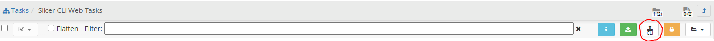
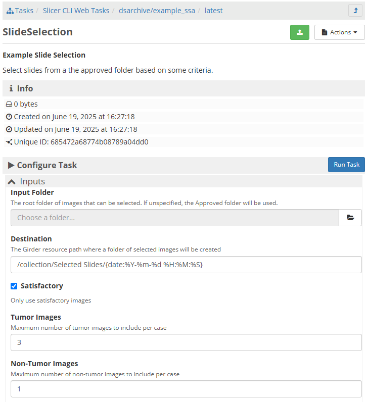

Installation for Running Tasks
==============================

See `INSTALL.rst <./INSTALL.rst>`_ for basic installation.  This has the same
prerequisites, but adds running custom tasks, like a third-party slide 
selection algorithm.

.. contents:: Table of Contents
    :depth: 1
    :local:
    :backlinks: none

Differences in Start
--------------------

Compared to starting without task support, we need to use a different docker-compose.yml file, and, for non-Windows systems, we need to specify the user that is running the process which grants permission to run other docker containers.

Pulling images, stopping, and updating are the same.

The start command changes to::

    docker-compose -f docker-compose.with-tasks.yml -f docker-compose.local.yml up -d

As before, the system will be available from a web browser on http://localhost:8080.

Adding a Task
-------------

Tasks can be added by going to ``Collections`` -> ``Tasks`` -> ``Slicer CLI Web Tasks`` and clicking the upload CLI button.

We need an example task to demonstrate.  This can be built from the command line by going to ``utilities/sample-algorithm`` directory, and running ``docker build --force-rm -t dsarchive/example_ssa .``.  At the end of this process, there will be a docker image named ``dsarchive/example_ssa:latest``.

Type ``dsarchive/example_ssa:latest`` in the Upload CLI Docker Images dialog and click ``Import Image``.  After a short amount of time, the new task will be available. 

Running a Task
--------------

Navigate to the task, e.g., ``Collections`` -> ``Tasks`` -> ``Slicer CLI Web Tasks`` -> ``dsarchive/example_ssa`` -> ``latest`` -> ``Slide Selection``.  Select the appropriate parameters as you desire and click ``Run Task``.

The ``Jobs`` link will show the progress of the task.

The sample slide selection algorithm will create a collection called ``Selected Slides`` that defaults to having a folder with the date that the task was run containing the selected slides.
