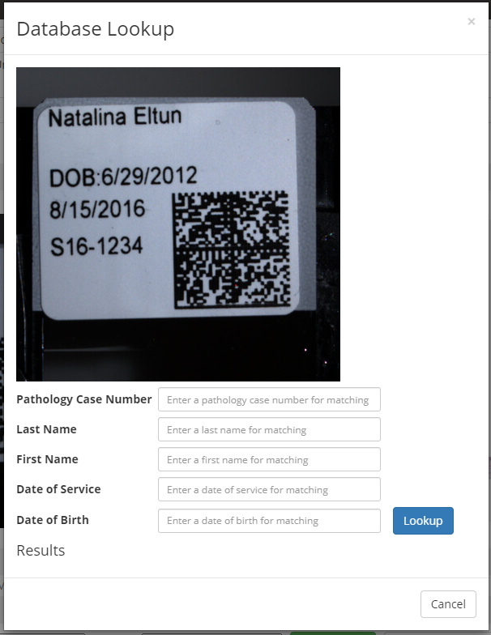
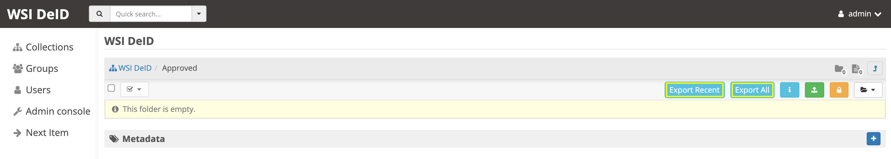

==============
WSI DeID Usage
==============

See `README.rst <../README.rst>`_ for high level information about how to navigate the full documentation.

This document describes how to use the WSI DeID software with the major use case of deidentifying Whole Slide Images (WSIs).

It includes the following major sections:

* `Browser Support <#browser-support>`__
* `Installation <#installation>`__
* `Girder Background <#girder>`__
* `User Management <#user-management>`__
* `Workflow Overview <#workflow-overview>`__
* `Navigating the WSI DeID <#navigating-the-wsi-deid>`__
* `Importing Data <#importing-data>`__
* `Redaction <#redaction>`__
* `PHI/PII Definitions and Types <#phipii-definitions-and-types>`__
* `Exporting Data <#exporting-data>`__
* `Error Messages <#error-messages>`__
* `Software Version <#software-version>`__

Browser Support
===============

WSI DeID works best using a recent version of the Chrome or Firefox browser.

Installation
============

See `INSTALL.rst <INSTALL.rst>`_ for installation instructions.

Girder
======

The WSI DeID is based on the Girder platform. For background on Girder concepts and navigation, see `GIRDER.rst <GIRDER.rst>`_.

User Management
===============

User Registration and Logins
----------------------------

When you first interact with the software through your browser, you will need to create a user for that web application by clicking on ``Register or Log In`` as highlighted in the yellow box in the screenshot below, and then registering your user. After registration, you may use the user credentials you created to ``Login`` to the WSI DeID.

.. image:: screenshots/register_or_login.png
   :alt: register or log in

If you are logged into the WSI DeID, your username will appear in the upper right-hand corner of the screen (highlighted in the yellow box), like for the user named ``admin`` in the screenshot below.

.. image:: screenshots/admin_user.png
   :alt: admin user logged in

User Types and Permissions
--------------------------

See `GIRDER.rst <GIRDER.rst>`_ for more information.

**Admin User:** The first registered user of a WSI DeID system will be an Admin user and will have super-user privileges, meaning that the user can take any actions on the system. Admin users can change permissions of other users in the system and can reset users' passwords. The Admin user should be tied to an IT support staff member, and users of the system should create Non-Super Users.

**Non-Super Users:** All subsequently created users will be Non-Super Users, who will have the ability to use the redaction workflows.

Workflow Overview
=================

There are seven folders an image file can be in within the WSI DeID Tool, including:

- ``AvailableToProcess``
- ``Quarantined``
- ``Redacted``
- ``Rejected``
- ``Original``
- ``Approved``
- ``Unfiled``

The workflow is depicted in the overall workflow diagram below.

This documentation will walk through the workflow following the steps of the workflow diagram above.

Step 1 Users Place Original WSIs in Local Folder
------------------------------------------------

The users will place original WSIs along with an Excel metadata file (the DeID Upload File) in their local import folder (a folder on their host filesystem). The metadata file should conform to the expected metadata file specification.

Step 2 Users Import Files
-------------------------

Users navigate to the ``AvailableToProcess`` folder in the WSI DeID and then follow the import process to import files into the system. See the Importing Data section for more information. If the images have import errors, then importing errors will be displayed, and the files will not be imported. Corrective action must be taken to fix the files before they can be imported.

When an image is first imported into the WSI DeID from the host filesystem, it will be renamed according to the import process and will be in the ``AvailableToProcess`` folder.

Step 3 Users Process and Deidentify Files
-----------------------------------------

Once an image is in the ``AvailableToProcess`` folder, the user can make the following selections in the User Interface (UI):

- ``Redact Image`` to redact it, sending it to the ``Redacted`` folder, and sending an original file to the ``Original`` folder (go to step 4)
- ``Quarantine`` for more reprocessing, sending it to the ``Quarantined`` folder (go to step 4a)
- ``Reject`` to mark that it is impossible to fix, sending it to the ``Rejected`` folder (go to Step 4b)

An image is copied into the ``Original`` folder before it will be redacted and will go into the ``Redacted`` folder, so that an unedited copy of the image is stored.

Step 4 Users Approve Deidentified Files
---------------------------------------

Images in the ``Redacted`` folder have gone through the redaction process but should be inspected to determine if they still contain PHI/PII or are fully cleared and ready for release.

Once an image is in the ``Redacted`` folder, the user can approve the file. The user can make the following UI selections:

- ``Approve`` to approve it, once it has been fully cleared for release. If this is pressed, then the image will move to the ``Approved`` folder, and then the view will change to the next image to be processed, as if you had clicked on the ``Next Item`` action in the left menu.
- ``Quarantine`` for more reprocessing, sending it to the ``Quarantined`` folder (go to step 4a)

Step 4a Users Contact IMS and Reprocess for Potential Resolution
----------------------------------------------------------------

The ``Quarantined`` folder is for holding images that may hold PHI/PII. Users should contact IMS via Squish (`https://www.squishlist.com/seerdms/support/ <https://www.squishlist.com/seerdms/support/>`__) for any WSI files in the ``Quarantined`` folder, and then review files for reprocessing based on instructions from IMS. If PHI/PII is seen in an image or metadata field, that is somewhere other than the ``AvailableToProcess`` folder, it should be quarantined for reprocessing. For definitions of PHI/PII categories available for recaction, refer to the `PHI/PII Definitions and Types section <#phipii-definitions-and-types>`__ of these usage instructions below.

Any time a WSI file has been quarantined, the source folder it was quarantined from will remain. This explains why some empty folders may be encountered in the system, that previously had WSI files in them.

Step 4b Users Review and Re-process Rejected Files After Software Updates
-------------------------------------------------------------------------

The ``Rejected`` folder  is available at any time.

There are two ways an image needs to be rejected: (a) there is PHI in the zoomable image in the WSI (e.g., someone wrote the patient name on the slide itself), or (b) there is PHI in a metadata field that is shown, but the software does not offer a redaction control for. In either of these cases, the image can be sent to the ``Rejected`` folder by clicking on the ``Reject`` button. Users should contact IMS for any WSI files in the ``Rejected`` folder.

The ``Reject`` button is available near the zoomable WSI image as a convenience to quickly reject a WSI file. If configured, a list of possible reasons for rejection will appear next to the button. Additional configuration can be made to require making a selection before rejecting an image. For additional information, see `CUSTOMIZING.rst <../CUSTOMIZING.rst>`_. See the screenshot below.

Step 5 Users Export DeID Files
------------------------------

When an image has been de-identified and is cleared for release, it will be in the ``Approved`` folder. The export process, described in the Exporting Data section below, will copy approved files to the export location.

In the ``Approved`` folder, two buttons appear at the top: ``Export Recent`` and ``Export All``, that will allow the user to export images.

Navigating the WSI DeID
=======================

Navigating by Folder
--------------------

After logging in, from the home page click on the ``Collections`` link (1) on the left menu and then click on the ``WSI DeID`` collection link (2), which is shown in the screenshot below.

After clicking on the ``WSI DeID`` collection link, you will be in the ``WSI DeID`` collection and should see the ``WSI DeID`` specific folders, as shown in the screenshot below.

.. image:: screenshots/wsideid_collection_folders_highlighted.png
   :alt: WSI DeID collection folders

From this folder listing, you can navigate to any folder you wish by clicking on the folder name link. For example, if you want to import data, go to the ``AvailableToProcess`` folder, or if you want to export data, go to the ``Approved`` folder. See the `Workflow Overview <#workflow-overview>`__ section above for a description of each folder.

Next Item Action
----------------

Clicking on the ``Next Item`` link on the left menu will bring you to view the first image in the ``AvailableToProcess`` folder, or else the first image in the ``Quarantined`` folder if there are no images in the ``AvailableToProcess`` folder.

For descriptions of other actions in the left menu, see `GIRDER.rst <GIRDER.rst>`_.

Folder Versus Item Views
------------------------

The WSI DeID is based on Girder (see `GIRDER.rst <GIRDER.rst>`_ for more information), which is structured as folders and items. **Folders** are similar to a directory on your local computer's filesystem, whereas **items** are a container for one or more files, such as would be on your local computer's filesystem. For the purposes of the WSI DeID documentation, an image is an item and  may be used interchangeably. A whole slide image file may contain multiple images, such as in the case where there is a primary image and associated images, such as a label or macro image.

A folder in Girder may contain items, and an item always has to be in a folder. When looking at the WSI DeID, if you are in a folder, you will see the folder icon on the upper right of the screen, as shown in the screenshot below taken from an ``AvailableToProcess`` folder. In this case, the folder has zero child folders and two items within the folder, which is why there is an icon of a folder with a ``0`` and an icon of a document with a ``2`` in the screenshot.

To see an item view of an image, click on the image/item's row in the folder view. You will then go to the item view, which looks like the screenshot below, of an item (a WSI file) named ``0579XY112001_01_13.svs`` that is located in the ``AvailableToProcess`` folder. In the info panel, you can see some metadata such as the image size and WSI DeID creation date. The item view will present you with subsections for a panning/zooming ``Image Viewer``, a listing of ``Large Image Metadata``, the set of ``Associated Images``, and image/item specific ``WSI DeID Workflow`` actions.

Below is a screenshot of the action buttons available in the ``WSI DeID Workflow`` section of the ``AvailableToProcess`` folder. Different folders will present different combinations of buttons, see the Workflow Overview section above for details.

Files & Links Actions
---------------------

There is a section of the WSI DeID that is titled ``Files & links``. Do not click on any of the buttons in this section unless you are intentionally performing low-level file management. These buttons are shown yellow box highlighted in the screenshot below.

Importing Data
==============

The import process assumes that the system has been configured with a mounted import directory, that is, the local filesystem folder that was mounted as the import path in the docker-compose configuration. For more information on setting up the import directory, see `INSTALL.rst <INSTALL.rst#import-and-export-paths>`__.

WSI files will be copied from the local import directory to the ``AvailableToProcess`` folder in the ``WSI DeID`` collection in the WSI DeID, after running the import process.

Imported File Types and Folder Structures
-----------------------------------------

The WSI DeID expects to import WSI files from Aperio, Hamamatsu, Philips scanners, some OME TIFF, and some DICOM Slide Modality files along with a single combined DeID Upload file (metadata file) that describes each of the WSI files to be imported. The DeID Upload file should be either an Excel file (identified by ending in .xls or .xlsx). More than one DeID Upload file may be placed in the mounted import directory, and all DeID Upload files of the correct type will be used in the import process. Any files other than WSI files and DeID Upload files will be ignored by the import process, meaning files ending in .txt, .xml, or .zip will be ignored. Files in the mounted import directory on the local filesystem can have any folder structure; the folder structure is not significant in the import process.

Step 1 Users Place Original WSIs and DeID Upload File(s) in Local Folder
------------------------------------------------------------------------

Place the WSIs and DeID Upload files in the mounted import directory. The sections above describe how to set up the mounted import directory and valid input file types.

Step 2 Navigate to the ``AvailableToProcess`` folder
----------------------------------------------------

See the Navigating the WSI DeID section above for more information.

Step 3 Press the Import Button
------------------------------

From the ``AvailableToProcess`` folder (or any sub folder) in the WSI DeID, click on the ``Import`` button, as shown in the screenshot below.

Clicking on the ``Import`` button will trigger a scan of the mounted import directory (i.e., where the software is directed to find the files), and will do the following:

- Each DeID Upload (Excel metadata) file is parsed for a header row that has TokenID, ImageID, and InputFileName.
- If there are any DeID Upload files that do not have a header row, an error is generated and appears on the screen, and files are not imported.
- If the same InputFileName is listed in multiple DeID Upload files, the information in the newest DeID Upload DeID Upload file is used by default.
- The InputFileName is expected to be just the file name (e.g., no folder path).

After the WSI file names and information in the DeID Upload file are reconciled, the WSI DeID software will classify WSI files as one of the following:

- ``Already Imported``: The file is listed in a DeID Upload file and is already in the WSI DeID based on file path and matching file size. No further action is needed.
- ``Imported``: The file is listed in a DeID Upload file and is not in the WSI DeID. It is added in the ``AvailableToProcess`` directory in a folder named as the TokenID with a filename of ImageID.<file extension> (for Aperio files it will be ImageID.svs).
- ``Updated``: The image is listed in a DeID Upload file and is in the WSI DeID, but has a different file size from the image in the WSI DeID. The existing file is removed from the WSI DeID and re-added.
- ``File missing``: The image is listed in a DeID Upload file but is not in the import directory. No import action is performed.
- ``Not in DeID Upload file``: The image is not listed in a DeID Upload file but is in the import directory. No import action is performed.
- ``Failed to import``: The listed file cannot be read as an image file.
- ``Error in DeID Upload file``: The row in the DeID Upload file failed to validate; the reason is shown in the report.
- ``Duplicate ImageID``: The same image ID was repeated in the DeID Upload file(s) for different filenames.
- ``Unfiled``: At the time of import, the WSI file could not be associated with a row in the DeID Upload file. The file was ingested to the ``Unfiled`` directory, and the system will attempt to match it to upload data.

Step 4 Import Status is Displayed
---------------------------------

After all images and all DeID Upload files have been processed, a message is displayed summarizing what images were in each of the classifications above (e.g., "Import completed. 3 images added. 1 DeID Upload Excel file parsed. See the Excel file report for more details."). If you click on the "See the Excel report for more details" link, it will download an import report, which will indicate which WSIs were imported or which failed to import and why. Users should review this report for any issues as outlined above.

The user may then proceed with the redaction workflow, described in the Workflow Overview section above.

Below is a screenshot of a message presented to the user after an import. See the Error Messages section below for all possible results of performing the import action.

Following Up on Unfiled Images
------------------------------

If your import schema does not have or does not require an ``InputFileName`` field, any WSIs in your import folder that could not be associated with a row on the DeID Upload file will first be ingested into the ``Unfiled`` directory.

After all files are ingested in this way, the system will attempt to match unfiled images to upload data by running Optical Character Recognition (OCR) to extract label text. If the system finds a match, that image will be copied to the ``AvailableToProcess`` directory, where redaction can continue as normal.

If a match cannot be determined, the image will remain in the ``Unfiled`` directory.

Unfiled images can be refiled using the controls at the bottom of the item page.  The ImageID becomes the new name of the image.  If manually specified, a distinct TokenID can be given as the new folder name; otherwise this is taken from the original import data or the base of the ImageID.  These controls appear as shown below:

Refiling images can also be performed at the folder level. Selecting any number of images in the ``Unfiled`` directory will cause bulk refile controls to appear.

Selected images can be refiled together (to a single subdirectory in ``AvailableToProcess``) or separately (to many subdirectories of ``AvailableToProcess``). If filing together, there is an additional option to use an existing TokenID. Available TokenIDs are determined during the import process. If filing as new tokens, the new token is generated randomly.

See `CUSTOMIZING.rst <../CUSTOMIZING.rst>`_ for more details on how new tokens are randomly generated.

You can also rename an unfiled image manually.  The image should be renamed and moved to the ``AvailableToProcess`` folder. See the screenshots below for more information.  In the item view for an item you would like to rename and transfer, from the Girder ``Actions`` button, click ``Edit Item``.

.. image:: screenshots/edit_girder_item.png
   :alt: actions button

Enter a new name for the item and click ``Save``.

Next, navigate back to the ``Unfiled`` directory. Check the box next to the item (or items) that you just renamed. From the ``Checked items`` dropdown, click ``Picked checked resources for Move or Copy``.

Once your items are picked, navigate to the ``AvailableToProcess`` directory. From the ``Checked items`` dropdown, click ``Move checked resources here``.

Database Lookup
---------------

If you have the SEER*DMS database configured, the images can also be filed based on information scanned from their labels and found in the SEER*DMS database.  If the label could not be read via OCR well enough to find a match, or multiple matches were found, the database can be manually searched and the results applied to the image.

In addition to the ``Refile Image`` button, there will be a ``Database Lookup`` button.

This will show a dialog with the label image of the current slide.  This example image is a test label that was attached to a slide with mouse tissue; it is not from a real person.  The dialog will look like:

Enter as much of the requested information as you can from the slide label and select ``Lookup``.  If the database returns any matches, they are shown in the dialog.  There may be multiple matches.  This might result in:

Select ``Apply`` next to the desired result.  The image will be refiled with the information from the database.

Checking on Running Jobs
------------------------

You can check on running background jobs by selecting your user name in the upper right and selecting "My Jobs".  The Jobs page shows running and completed jobs.  Selecting a running job will show its progress.

Alternate Import - Direct From Assetstore
-----------------------------------------

Girder supports importing files directly from an assetstore.  See the Girder documentation on how this is done.  If images and folders are imported into the ``Unfiled`` folder, they are treated as if they were imported via the ``Import`` button from the import folder.  Because the general import allows importing any files, you may have non-image files in the system.

Redaction
=========

At a high level in the Redaction process, the user can inspect the image and metadata for PHI/PII, and can indicate if any of these should be redacted. Redaction can occur from the ``AvailableToProcess`` or ``Quarantined`` folder. Below are the specific steps to follow for the Redaction process. When a field is redacted so that it is changed, the original value in that redacted data field is completely replaced with the new value. When a field or image is redacted completely, it is removed and will not be available in the future.

Review Process for PHI/PII in Image(s) and Metadata
---------------------------------------------------

1. Open the WSI file, either by clicking on a specific Item or clicking the ``Next Item`` action.

2. Review the image(s) and metadata fields for PHI/PII. Definitions of PHI/PII categories in the redaction drop-down menu are listed in the `PHI/PII Definitions and Types section <#phipii-definitions-and-types>`__.

   2.1. Review the zoomable image (top image after opening the WSI file). If the low-resolution image at the top of the screen (see screenshot below) contains PHI/PII, then click ``Reject``. If there is no PHI/PII, then go on to the next step. You may zoom and pan in the low-resolution image to see areas of the image in higher resolution.

   2.2. Review metadata for PHI/PII, by scrolling down below the main image to the metadata section display. Some metadata fields will be automatically pre-redacted upon import, including titles and dates that are specific to each scanner manufacturer. See the Business Rules for WSI DeID section below for details.

   The user can view metadata fields, and if any of these contain PHI/PII, the user should select the classification of PHI in the redact control for that field (see the PHI/PII Definitions and Types, below). The metadata field will then have a line through the text, indicating that the field will be redacted (it has been marked for redaction).

   If editing metadata is enabled (see `CUSTOMIZING.rst <CUSTOMIZING.rst>`_ for details turning this on), a text box will appear next to any metadata field that has been marked for redaction. Users can type a new value into this field, to replace the redacted value. This text box only appears if a metadata field is marked for redaction.

   2.3. Scroll down to the bottom of the screen and review the associated images (label, macro, and thumbnail).  If you see PHI/PII in individual associated images, select the classification of PHI in the image from the redact control. The image will show an X through it to indicate that it will be redacted.

   In addition, a button will appear with the label ``Redact Area``. Clicking on this button will allow drawing on the image in order to redact a specific region instead of the entire image. This selection can be cancelled by clicking the button again.

   2.4. When redaction decisions have been made for all images and metadata, the user should click the ``Redact Image`` button, which will make a copy of the existing image and place that copy in the ``Original`` folder, and will move the image to the ``Redacted`` folder. As part of moving the data to the ``Redacted`` folder, the metadata fields and associated images that have been marked for redaction will be deleted.

3. If after redacting, all PHI/PII has been removed, click the green ``Approved`` button.

PHI/PII Definitions and Types
=============================

The table below describes the redaction options and definitions of PHI/PII categories.

.. csv-table::
    :header-rows: 1
    :widths: 20, 40, 40

    PHI/PII Type,Redaction Selection,Definitions
    Personal Information,Patient Name,
    Personal Information,Patient Date of Birth,
    Personal Information,Patient Social Security Number,
    Personal Information,Other Personal,Patient's Maiden Name
    Personal Information,Other Personal,Mother's Maiden Name
    Personal Information,Other Personal,Family Member's Name
    Personal Information,Other Personal,Full Face Photograph
    Personal Information,Other Personal,Patient's E-mail Address
    Personal Information,Other Personal,Patient's Phone or Fax Number
    Demographics,Demographics,Patient's Age
    Demographics,Demographics,Patient's Geographic Location (any)
    Demographics,Demographics,Patient's Location of Birth
    Facility/Physician Information,Facility/Physician Information,Facility Name or Address
    Facility/Physician Information,Facility/Physician Information,Laboratory Name or Address
    Facility/Physician Information,Facility/Physician Information,Physician Name or Address
    Facility/Physician Information,Facility/Physician Information,Admission Date ``*``
    Facility/Physician Information,Facility/Physician Information,Test/Procedure/Specimen Date ``*``
    Facility/Physician Information,Facility/Physician Information,Date of Service ``*``
    Facility/Physician Information,Facility/Physician Information,Facility Phone or Fax Number
    Facility/Physician Information,Facility/Physician Information,Laboratory Phone or Fax Number
    Facility/Physician Information,Facility/Physician Information,Internet Protocol (IP) addresses
    Facility/Physician Information,Facility/Physician Information,Web Universal Resource Locators (URLs)
    Other PHI/PII,Other PHI/PII,Medical Record Number
    Other PHI/PII,Other PHI/PII,Financial Number
    Other PHI/PII,Other PHI/PII,Account Number
    Other PHI/PII,Other PHI/PII,Health Plan Beneficiary Number
    Other PHI/PII,Other PHI/PII,Device Identifiers/Serial Numbers

``*`` For these dates, year is permissible; however, full or partial date including the day and/or month is considered PHI/PII.

See `CUSTOMIZING.rst <CUSTOMIZING.rst>`_ for information on customizing the PHI/PII types that can be selected.

Exporting Data
==============

The export process assumes that the system has been configured with a mounted export directory, that is, the local filesystem folder that was mounted as the export path in the docker-compose configuration. For more information on setting up the export directory, see `INSTALL.rst <INSTALL.rst#import-and-export-paths>`__.

Step 1 Users Process Images into ``Approved`` Folder
----------------------------------------------------

If users have followed the redaction workflow, described in the Workflow Overview section above, and have images in the ``Approved`` folder, they may proceed to export these files out of the DSA WSI DeID for transfer.

Step 2 Users Click ``Export Recent`` or ``Export All`` Buttons
--------------------------------------------------------------

In the ``Approved`` folder, two buttons appear at the top: ``Export Recent`` and ``Export All``, as shown in the screenshot below. Clicking either button copies files from the ``Approved`` folder to the mounted export folder. The subfolder structure within the ``Approved`` folder is maintained as part of the export. If a file already exists in the export folder, then that file will be skipped during the export process so as to not overwrite the existing file in the export directory.

Recent exports are any items in the ``Approved`` folder that have not been exported before. After each export, items are tagged with metadata indicating that they have been exported.

After export, a message is shown indicating how many files were exported and giving the user a chance to download the Excel export report (DeID Export File) for more details. See the screenshot below to see an export message example.

Business Rules for WSI DeID
---------------------------

These business rules will be automatically applied at the time of data import to the metadata.

The following rules apply to all file formats except iSyntax:

* ``tiff.DateTime`` (if present), set to 01:01:(year and time)
* ``tiff.Copyright``: removed
* ``tiff.HostComputer``: removed
* ``tiff.Software``: modified by adding custom tags with data from the DeID Upload file

These rules apply only to Aperio files:

* ``aperio.Filename``: change or add to ImageID
* ``aperio.Title``: change or add to ImageID
* ``aperio.Date`` (if present), set to 01/01/(year)

These rules apply only to Hamamatsu files:

* ``hamamatsu.Reference``: change or add to ImageID
* ``hamamatsu.Created`` (if present): set to (year)/01/01
* ``hamamatsu.Updated`` (if present): set to (year)/01/01

These rules apply only to Philips TIFF files:

* ``PIIM_DP_SCANNER_OPERATOR_ID``: change or add to ImageID
* ``PIM_DP_UFS_BARCODE``: change or add to ImageID
* ``DICOM_DATE_OF_LAST_CALIBRATION`` (if present): set to (year)0101
* ``DICOM_ACQUISITION_DATETIME`` (if present): set to (year)0101 (time)

These rules apply only to OME.TIFF files:

* ``Series 0 Filename``: change or add to ImageID
* ``Image FileName``: change or add to ImageID
* ``Series 0 Date`` (if present), set to 01/01/(year)

These rules apply only to Philips iSyntax files:

* ``scanner_operator_id``: change or add to ImageID
* ``barcode``: change or add to ImageID

Below is a screenshot of image PHI/PII redaction controls for metadata.

The ``aperio.AppMag`` field has been marked for redaction.

.. image:: screenshots/redact_metadata.png
   :alt: redact metadata controls

Below is a screenshot of image PHI/PII redaction controls for Associated Images, with the ``Macro`` image marked for redaction.

.. image:: screenshots/redact_images.png
   :alt: redact images controls

Label images that are redacted are replaced with a black image that contains text of the item's new name (for the purposes of the WSI Pilot this new name will be the ImageID), such as in the screenshot below.

Error Messages
==============

For explanations of error messages that the user may encounter, see `ERROR-TABLES.rst <ERROR-TABLES.rst>`_.

Software Version
================

If you have found a bug, it is helpful to know what the software version is when you report the bug to your support channels. The software version can be found on the front page of the web application and will be in the section that looks like ``WSI DeID Version: 2.0.0``. In this example the version string is ``2.0.0``, but you should expect a different version string for your WSI DeID instance.
